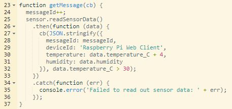
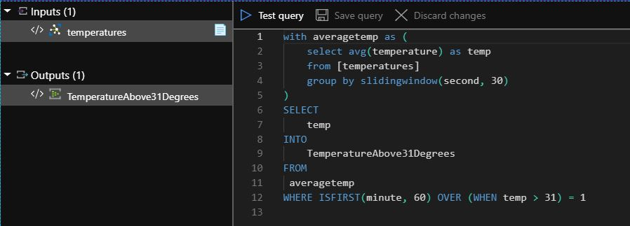
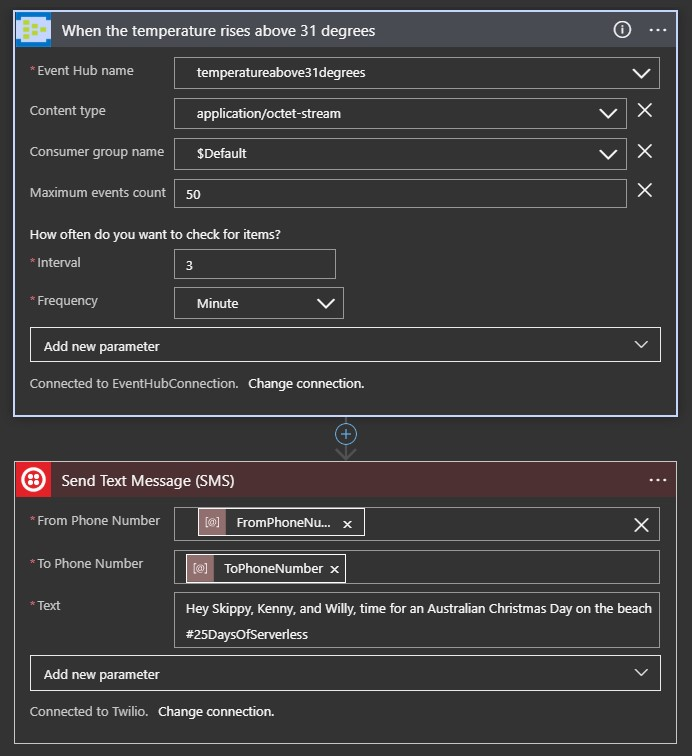

# Challenge 17: Azure IOT Hub

## Time for an Australian Christmas day BBQ on the beach

Skippy the Kangaroo and his mates, Kenny the Koala and Willy the Wombat, were very excited and looking forward to Christmas.

"Only a week to go!" said Kenny the Koala, "and I've been very good all year!"

Skippy and Willy looked at each other and rolled their eyes. "You haven't been THAT good," they thought. Skippy reminded his mates, "it’s not all about presents! My favourite part of Christmas is going to the beach, firing up the BBQ, having a nice cold beer, and relaxing with my friends and family. Let’s hope it's a sunny day!".

Your challenge is to build Skippy and his friends an Internet of Things system that helps let them know if it's a warm day at the beach. They want someting that can send them a tweet if it's currently warmer than 31°C (88° Fahrenheit) so they know whether or not to head all the way out to the beach for a truly Australian Christmas Day!

A tip: if you don't want to pull out a physical IoT device, you may want to use the Raspberry Pi Simulator to connect to the Azure IoT Hub.

# Solution

## Technologies

- Raspberry Pi Azure IoT Online Simulator
- Azure IoT Hub
- Azure Event Hub
- Azure Stream Analytics
- Azure Logic App with Event Hub and Twilio Connector

## Step by Step

### Create IoT Hub and setup the temperature simulator

We will create an IoT Hub and connect it to the Raspberry Pi Azure IoT Online Simulator. This way we will be able to read the temperature measurements from the sensor.

- Create a new IoT Hub and connect it to the Raspberry Pi Azure IoT Online Simulator as described [here](https://docs.microsoft.com/en-us/azure/iot-hub/iot-hub-raspberry-pi-web-simulator-get-started#run-a-sample-application-on-pi-web-simulator)
- I increased the temperature of the sensor by 4 to increase the likelihood of the temperature reaching 31 degrees 

### Create Event Hub

The Event Hub will be used to collect all events of the temperature rising above 31 degrees. We will later create a Logic App that will send a notification to Skippy and his friends whenever an event in the Event Hub occurs.

- Create a new Event Hub Namespace with an Event Hub

### Create Stream Analytics Job

We want to send a message to Skippy and his friends when the temperature rises above 31 degrees. As soon as the temperature is 31 degrees the following measurements will likely also be above 31 degrees for a while. To avoid sending a message every time a new measurement above 31 degrees is recorded, we will use Azure Stream Analytics to filter out the following measurements.
The Stream Analytics Job will connect the stream of temperatures from the temperature sensor simulator of the IoT Hub to the Event Hub.

- Create a Stream Analytics Job
- Create a stream input and select the IoT Hub as a source
- Create an output and select the Event Hub created in the previous step
- Create a query: 
- Start the job

### Create Logic App

- Create a new Logic App
- Add an Event Hub Trigger in the template designer and select the created Event Hub
- Add a new step to send a notification to Skippy and his friends. I decided to send a SMS with Twilio instead of a Tweet as suggested in the challenge description.
  
